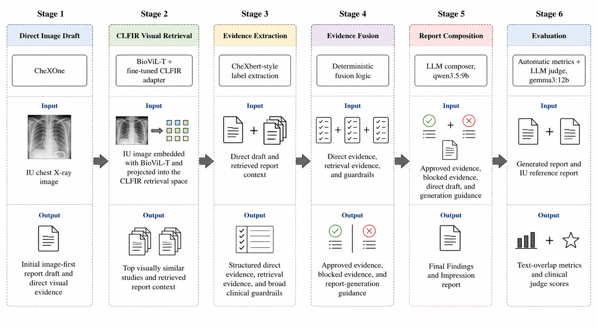
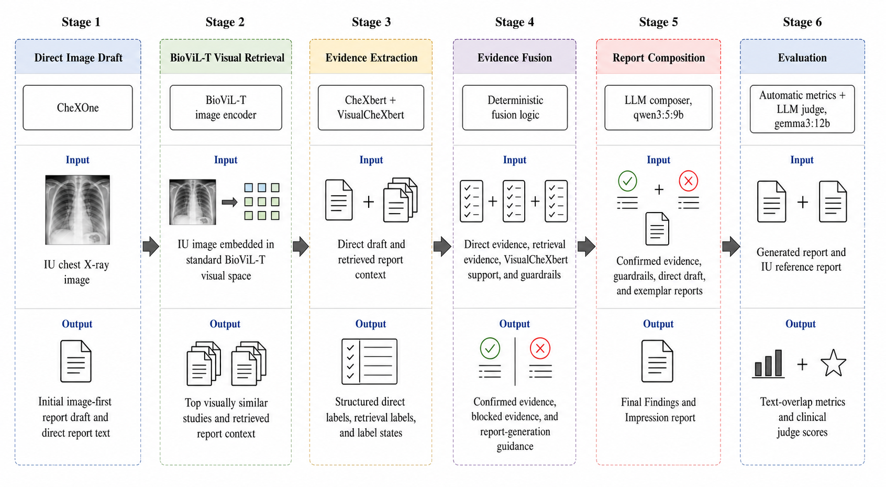

# IU CXR Report Generation with CLFIR-Guided Evidence Fusion

This repository contains the cleaned deliverable for an IU chest X-ray report generation project. The main submitted pipeline is Proposed Improvement 2, implemented as a Jupytext-paired notebook and Python script.

The full local development workspace, datasets, model weights, retrieval banks, LLM caches, and per-stage artifact folders are intentionally not included. Only the submission notebook/code and compact evaluation outputs are provided.

## Repository Contents

```text
.
├── notebooks/
│   ├── iu_pipeline_baseline_yi_5_agent.ipynb
│   ├── iu_pipeline_baseline_yi_5_agent.py
│   ├── iu_pipeline_proposed_improvement_1.ipynb
│   ├── iu_pipeline_proposed_improvement_1.py
│   ├── iu_pipeline_proposed_improvement_2.ipynb
│   └── iu_pipeline_proposed_improvement_2.py
└── results/
    ├── baseline/
    │   ├── summary.json
    │   ├── per_study_summary.csv
    │   ├── baseline_results.json
    │   ├── baseline_results590.json
    │   ├── five_agent_results.json
    │   ├── five_agent_judge_scores.json
    │   ├── baseline_metrics.json
    │   ├── five_agent_metrics.json
    │   ├── baseline_judge_metrics.json
    │   ├── five_agent_judge_metrics.json
    │   ├── standard_metrics_table.csv
    │   ├── judge_metrics_table.csv
    │   └── paper_tables.json
    ├── more_imp1/
    │   ├── summary.json
    │   └── per_study_summary.csv
    ├── proposed_improvement_1/
    │   ├── summary.json
    │   └── per_study_summary.csv
    ├── proposed_improvement_2/
    │   ├── summary.json
    │   └── per_study_summary.csv
    └── comparisons/
        ├── judge_criteria_comparison_dashboard.png
        ├── automatic_metrics_comparison_dashboard.png
        ├── corpus_automatic_metrics.png
        ├── judge_criteria_paired_scores.csv
        ├── automatic_metrics_paired_scores.csv
        └── comparison_summary.json
```

## Project Overview

The pipeline generates concise IU-style chest X-ray reports with two required sections: `Findings:` and `Impression:`.

At a high level, it uses:

- **CheXOne** as an image-first direct report draft.
- **BioViL-T / CLFIR adapter retrieval** to retrieve visually related studies.
- **CheXbert-style label evidence** to summarize retrieved reports in a coarse label space.
- **Deterministic evidence fusion** to combine direct image evidence with retrieval-text evidence.
- **LLM report composition** to write the final report from the approved evidence.
- **LLM judging** to compare generated reports against IU reference reports.

The submitted notebook is designed to resume from disk artifacts when run in the original local environment. External datasets, model snapshots, retrieval banks, and generated stage artifacts are excluded from this repository due to size and portability.



## Proposed Improvement 2 CLFIR Adapter Training and Use

The CLFIR adapter used by the retrieval stage is a fine-tuned image-text retrieval projection module. It is not a report generator by itself. Its role is to map BioViL-T image embeddings into a retrieval space that is better aligned with radiology report text.

Training setup:

- Image encoder input: BioViL-T projected global image embedding, `128d`.
- Text encoder: `pritamdeka/S-PubMedBert-MS-MARCO`.
- Shared retrieval projection size: `512d`.
- Max text length: `320` tokens.
- Mixup lambda range: `0.92` to `0.99`.
- Optimizer from checkpoint state: AdamW, initial learning rate `3e-5`, weight decay `0.01`, betas `(0.9, 0.999)`.
- Selected checkpoint: epoch `18`.
- Validation retrieval metrics at the selected checkpoint:
  - image-to-text recall@1: `0.0758`
  - image-to-text recall@5: `0.2302`
  - image-to-text recall@10: `0.3247`
  - text-to-image recall@1: `0.0790`
  - text-to-image recall@5: `0.2230`
  - text-to-image recall@10: `0.3243`

At inference time, the query IU chest X-ray is embedded with BioViL-T, projected through the trained CLFIR image projection layer, L2-normalized, and searched against the CLFIR FAISS visual bank. The retrieved studies provide soft evidence for later fusion; they are not copied directly into the final report.

## Submitted Pipeline: Proposed Improvement 2

The primary submitted pipeline is Proposed Improvement 2:

- Notebook: `notebooks/iu_pipeline_proposed_improvement_2.ipynb`
- Paired script: `notebooks/iu_pipeline_proposed_improvement_2.py`
- Output directory in the repo notebook: `current_proposed_improvement_2`

Important run settings:

- Evaluation limit: `200`
- Composer model: `qwen3.5:9b`
- Judge model: `gemma3:12b`
- Jupytext format: paired `.ipynb` and `.py`

The paired Python file is included so the notebook can be reviewed as executable source without relying only on notebook JSON.

## Baseline Results

The `results/baseline/` folder is reserved for the cleaned Yi et al.-style five-agent baseline reproduction. It is kept separate from the CheXOne direct baseline reported inside the CLFIR result summaries.

Baseline design:

- Reproduction target: the multimodal multi-agent radiology report generation framework described by Yi et al.
- Single-agent baseline: LLaVA-Med 1.5 7B generates an IU chest X-ray report directly from the image.
- Retrieval agent: OpenCLIP ResNet-50 retriever fine-tuned on 3,000 MIMIC-CXR image-report pairs.
- Retrieval checkpoint: `retriever_openclip_mimic3000.pt`, supplied locally as `retriever_openclip_mimic3000.tar` in the development workspace. Model weights are not committed to this repository.
- Five-agent flow: retrieve related reports, draft from retrieved context, generate a visual description with LLaVA-Med, refine the draft, then synthesize the final report.
- Local LLM adaptation: Gemini can be used when an API key is provided; otherwise the cleaned notebook uses local Ollama models for consistency with the CLFIR runs.
- Local Ollama defaults: composer `qwen3.5:9b`, judge `gemma3:12b`.
- Evaluation alignment: the judge prompt and automatic metric output schema were cleaned to match the CLFIR notebooks.

The cleaned baseline notebook removes brittle fallback behavior where possible, keeps checkpointed generation/evaluation outputs, and writes to a dedicated artifact root in the development workspace. It is included conceptually as the literature-inspired reference pipeline, while this repository intentionally excludes its large model files, retrieval checkpoint, full caches, and raw per-stage artifacts.

Baseline result files are included under `results/baseline/`. The large OpenCLIP checkpoint and IU retrieval bank are intentionally excluded.

Included baseline files:

- `baseline_results.json`: 200 single-agent LLaVA-Med report outputs.
- `baseline_results590.json`: larger single-agent baseline output dump retained for auditability.
- `five_agent_results.json`: 200 Yi-style five-agent report outputs.
- `five_agent_judge_scores.json`: per-study Gemini judge scores for the five-agent run.
- `baseline_metrics.json` and `five_agent_metrics.json`: compact automatic metric summaries.
- `baseline_judge_metrics.json` and `five_agent_judge_metrics.json`: compact judge metric summaries.
- `standard_metrics_table.csv`, `judge_metrics_table.csv`, and `paper_tables.json`: table-ready result exports.
- `summary.json` and `per_study_summary.csv`: normalized compact files matching the repo result-folder convention.

Excluded baseline files:

- `retriever_openclip_mimic3000.pt`: large OpenCLIP retrieval checkpoint.
- `iu_retrieval_bank.pt`: large serialized retrieval bank.
- `baseline_res.zip`: redundant archive of files already represented in extracted form.

Important comparability note:

- The Yi-style baseline output contains 200 IU studies.
- These 200 studies are not the same sample set as the current Proposed Improvement 2 first-200 split.
- The baseline should therefore be read as a local reproduction attempt and failure analysis, not as a perfectly paired score comparison.

Observed baseline metrics:

- Single-agent LLaVA-Med BLEU: `0.0065`
- Single-agent LLaVA-Med ROUGE-1: `0.0937`
- Single-agent LLaVA-Med METEOR: `0.1471`
- Single-agent LLaVA-Med BERTScore: `0.8625`
- Five-agent BLEU: `0.0116`
- Five-agent ROUGE-1: `0.1100`
- Five-agent METEOR: `0.1902`
- Five-agent BERTScore: `0.8502`

Gemini judge metrics from the baseline run:

- Single-agent LLaVA-Med findings: `1.375`
- Single-agent LLaVA-Med consistency: `2.120`
- Single-agent LLaVA-Med diagnosis: `1.930`
- Five-agent findings: `1.325`
- Five-agent consistency: `6.990`
- Five-agent diagnosis: `1.205`

The main failure mode was the LLaVA-Med visual agent. In the 200-study run, the visual caption mentioned pleural effusion in `200/200` cases, the final five-agent report mentioned pleural effusion in `200/200` cases, and the final report mentioned pneumothorax in `185/200` cases. This contaminated the Gemini synthesis stage even when retrieved reports were often normal or clinically reasonable.

## Proposed Improvement 1 Results

The `results/proposed_improvement_1/` folder contains the first proposed improvement pipeline. This is not the main submitted Proposed Improvement 2 method and it is not a CLFIR adapter pipeline.

Proposed Improvement 1 design:

- Starting point: an earlier IU end-to-end pipeline with image-first report generation, visual retrieval, pathology-aware retrieval, multi-stage report composition, and evaluation.
- Direct image model: CheXOne produces the image-first draft report.
- Retrieval: uses the original visual/pathology retrieval structure from the proposed-improvement notebook, without CLFIR.
- Label evidence: CheXbert labels are used for report-text evidence extraction, including positive, uncertain, negative, and blank/not-mentioned states.
- VisualCheXbert use: VisualCheXbert is retained as an auxiliary label source over the Stage 1 CheXOne report text, not as an image model.
- Important label-state fix: raw CheXbert/VisualCheXbert negative `0` is mapped internally to the state `negative` and score `-1.0`; blank/not-mentioned remains `0.0`.
- Keyword-derived label fallbacks are not used.
- CheXOne label-prompt outputs are not used as evidence.
- Local LLM adaptation: Gemini can be used when an API key is provided, but the cleaned local path uses the same Ollama defaults as the CLFIR notebooks.
- Local Ollama defaults: composer `qwen3.5:9b`, judge `gemma3:12b`.
- Evaluation alignment: the final evaluation block was updated to report the same compact metrics as Proposed Improvement 2, including BLEU, ROUGE, METEOR, BERTScore, sacreBLEU, chrF, chrF++, and LLM judge overall.

The purpose of this experiment is to test whether the earlier non-CLFIR retrieval pipeline can be made cleaner and more comparable by replacing weak fallback label logic with CheXbert-derived text evidence and by standardizing the LLM/evaluation setup. This experiment should be read as a separate non-CLFIR ablation, not as a CLFIR variant.



Proposed Improvement 1 result files are included under `results/proposed_improvement_1/`.

Run summary:

- Evaluation limit: `200`
- Completed pipeline reports: `200/200`
- Completed pipeline judge scores: `200/200`
- Pipeline judge overall: `7.745`
- CheXOne direct judge overall: `7.290`
- Pipeline BLEU: `0.103`
- Pipeline ROUGE-1: `0.405`
- Pipeline ROUGE-2: `0.165`
- Pipeline ROUGE-L: `0.298`
- Pipeline METEOR: `0.359`
- Pipeline BERTScore F1: `0.855`
- Pipeline sacreBLEU: `11.462`
- Pipeline chrF: `39.614`
- Pipeline chrF++: `36.753`

Separate retrieval-only comparison note:

- This is not part of Proposed Improvement 1 itself.
- It compares the plain BioViL-T visual retrieval used by Proposed Improvement 1 against the CLFIR-projected visual retrieval used by Proposed Improvement 2.
- On the overlapping 100-study retrieval split, CLFIR improved the top-1 retrieved-report token F1 proxy by about `2.7%` and the mean top-5 token F1 proxy by about `2.5%` over plain BioViL-T. The best-of-top-5 proxy was essentially flat at about `+0.1%`.
- This means CLFIR gave a small but measurable retrieval-quality improvement in the first retrieved candidates; the larger final-report gains come from evidence fusion and report composition, not retrieval alone.

## Proposed Improvement 2 Results

The `results/proposed_improvement_2/` folder contains the current CLFIR-guided pipeline run. This is the second proposed improvement and is the main submitted pipeline.

Proposed Improvement 2 design:

- Starting point: the structured evidence pipeline direction from Proposed Improvement 1.
- Retrieval upgrade: BioViL-T image embeddings are projected through the fine-tuned CLFIR adapter before FAISS retrieval.
- Direct image model: CheXOne provides the image-first draft report.
- Label evidence: CheXbert-derived report labels and retrieval-text labels provide structured 14-label evidence states.
- Evidence control: deterministic fusion combines direct evidence, retrieval evidence, and guardrails before report composition.
- Composer: `qwen3.5:9b`.
- Judge: `gemma3:12b`.
- Output source in the repo notebook/artifact naming convention: `pipeline/artifacts/iu_pipeline_bundle/current_proposed_improvement_2`.

Proposed Improvement 2 files:

- Notebook: `notebooks/iu_pipeline_proposed_improvement_2.ipynb`
- Paired script: `notebooks/iu_pipeline_proposed_improvement_2.py`
- Results: `results/proposed_improvement_2/summary.json`
- Per-study outputs and scores: `results/proposed_improvement_2/per_study_summary.csv`

Run summary for Proposed Improvement 2:

Pipeline:

- Evaluation limit: `200`
- Completed reports: `200/200`
- Completed judge scores: `200/200`
- Judge overall: `7.800`
- BLEU: `0.118`
- ROUGE-1: `0.414`
- ROUGE-2: `0.171`
- ROUGE-L: `0.306`
- METEOR: `0.348`
- BERTScore F1: `0.854`
- sacreBLEU: `12.649`
- chrF: `40.705`
- chrF++: `37.601`

CheXOne direct baseline on the same 200 studies:

- Completed reports: `200/200`
- Completed judge scores: `200/200`
- Judge overall: `7.290`
- BLEU: `0.094`
- ROUGE-1: `0.394`
- ROUGE-2: `0.152`
- ROUGE-L: `0.276`
- METEOR: `0.298`
- BERTScore F1: `0.852`
- sacreBLEU: `8.646`
- chrF: `31.234`
- chrF++: `29.310`

## Experimental Comparison

The main paper progression in this repository is:

1. `baseline`: Yi-style multimodal multi-agent reproduction.
2. `proposed_improvement_1`: non-CLFIR structured evidence pipeline.
3. `proposed_improvement_2`: CLFIR-guided structured evidence pipeline.

The `results/more_imp1/` and `results/comparisons/` folders are retained as historical exploratory material from an Adapter2 variant, but they are not the main three-system progression requested for the deliverable.

## Interpretation

Proposed Improvement 2 is the strongest current clean pipeline in this repository. It improves over the CheXOne direct baseline on both LLM judge score and automatic metrics in the current 200-study run.

Compared with the Yi-style baseline, the project moved away from repeated free-form LLM agents and toward a more inspectable structure: direct image-first drafting, retrieval, structured label evidence, deterministic fusion, and a single final composer. Proposed Improvement 1 tests that structure without CLFIR; Proposed Improvement 2 adds the CLFIR retrieval adapter.

## Notes on Reproducibility

This repository does not include:

- IU-Xray or MIMIC datasets.
- Model weights or local Ollama model files.
- Full retrieval banks.
- Full per-stage pipeline artifacts.
- LLM prompt caches.

The compact result files under `results/` are included so the reported metrics and comparison plots can be inspected without requiring the original full artifact bundle.
